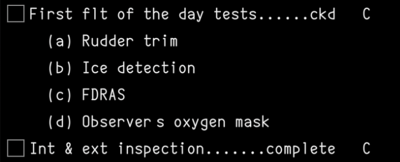
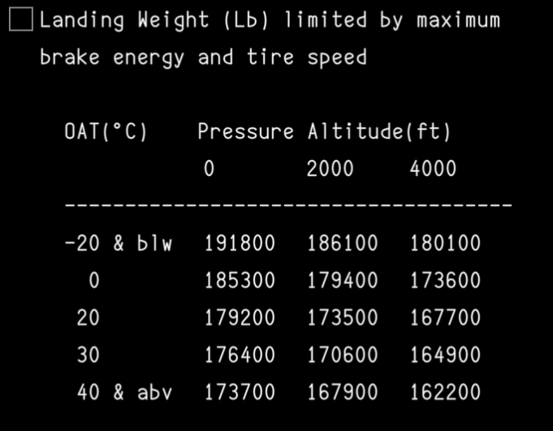
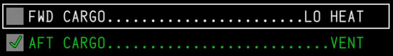
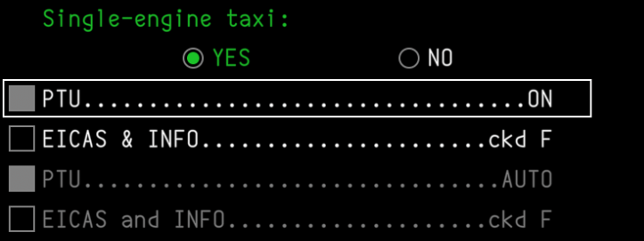
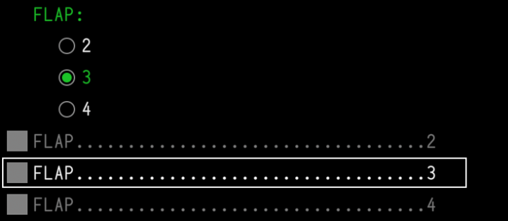
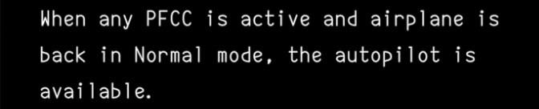
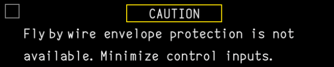
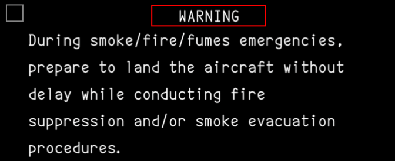

Each livery can ship its own Electronic Checklist (ECL) package. This page covers using our editor to import, export, and create checklist files.

<LinkButton href="https://ecl.synapticsim.com">
  Open the checklist editor
</LinkButton>

## Organization

The top-level organizational unit is the **checklist package**. It includes a name, an optional part number, and three categories of checklists:

| Category | Grouping | Per-checklist metadata |
| --- | --- | --- |
| **Normal** | Flat list, no grouping | Phase (Pre-Flight, In-Flight, or Post-Flight) |
| **Non-Normal** | Grouped into named **systems** | CAS message that triggers this checklist |
| **Procedure** | Grouped into named **sections** | |

The sidebar tree mirrors this structure. Each category header has a `+` to add a checklist (or a system/section, for Non-Normal and Procedure), and the search box at the top filters the whole tree by checklist name.

Checklists and sections can be dragged (via the `⋮⋮` handle) to reorder them, or dropped into a different system/section/category to move them — including across categories. Deleting a checklist, section, or database that still has content prompts for confirmation first.

The editor can hold more than one package open at once (each gets its own root in the sidebar tree), which is convenient for referencing another package while building a new one.

## Import & Export

The editor works with two levels of JSON file:

- **Package** — the whole database: its name, an optional part number, and every checklist across all three categories (Normal, Non-Normal, Procedure).
- **Checklist** — a single checklist and its items. A checklist file has no category of its own — that's contextual to where it lives in a package — so on import it's always placed into the Normal category first; drag it into a Non-Normal system or Procedure section afterward if that's where it belongs.

Use the **Export** button (top right) to export the current package or just the currently-open checklist. Use **Import** (bottom of the sidebar) to load a package file, or one or more checklist files at once — each file is validated independently, so one bad file won't block the rest from importing.

## Item types

Items are added between existing rows via the `+` control, which lists all six types below. Numbering is sequential and continues into branches (a Conditional or Multi-Select item's branches pick up numbering where the parent left off).

### Action

The core checklist line: a **challenge** and **response**, separated by leader dots. The majority of checklist items fall into this category.

#### Comments

An action can optionally define free-form comments that are shown indented below the action item. This is often used for reference tables or additional information to refer to when completing the item.

  

#### Sensed

Links the item to an aircraft-computed variable so it can be automatically detected as complete, instead of relying on the pilot to manually check it off. Enabling it reveals a variable picker plus two more toggles:

- **Invert** — flips the sensed condition, so the item is satisfied when the variable is `false` instead of `true`
- **Latch** — once sensed, stays satisfied even if the underlying condition later clears (rather than reverting to unchecked)

#### Timed

Adds a countdown timer, in seconds, to the checklist when the item is checked. Useful for steps that require waiting a fixed duration before continuing.

<Callout title="Not Yet Implemented" type="warn">
    The checklist data model supports this field, but it is not yet supported in the simulator. This will be addressed in an upcoming feature update.
</Callout>

#### Limitation

Flags the item as an operational limitation, prompting it to appear on the `SUMMARY` page after the checklist is completed.

<Callout title="Not Yet Implemented" type="warn">
    The checklist data model supports this field, but it is not yet supported in the simulator. This will be addressed in an upcoming feature update.
</Callout>

#### Deferred

Defers this item to another checklist. When the current checklist is marked as complete, the next checklist will include this item at the very top.

<Callout title="Not Yet Implemented" type="warn">
    The checklist data model supports this field, but it is not yet supported in the simulator. This will be addressed in an upcoming feature update.
</Callout>

#### Follow-On

Links another checklist to this item. When the current checklist is marked as complete, the next checklist will be displayed on the `SUMMARY` page.

<Callout title="Not Yet Implemented" type="warn">
    The checklist data model supports this field, but it is not yet supported in the simulator. This will be addressed in an upcoming feature update.
</Callout>

### Conditional

A branching item prompting the pilot to answer **YES** or **NO**. When a choice is made, only that branch will be active. Either branch can contain any number of checklist items, including other conditionals.

### Multi-Select

Similar to a conditional item, but allows for any number of free-form options to be selected.

### Free text

A single line of free-form text with no challenge/response. Handy for instructions, headers of conditional or multi-select blocks, or additional context that isn't an actionable step.

### Note

A callout line with a severity level of **Note**, **Caution**, or **Warning**.

### Page break

Forces all following items to appear on the next page of the checklist. Does not render anything on its own.
