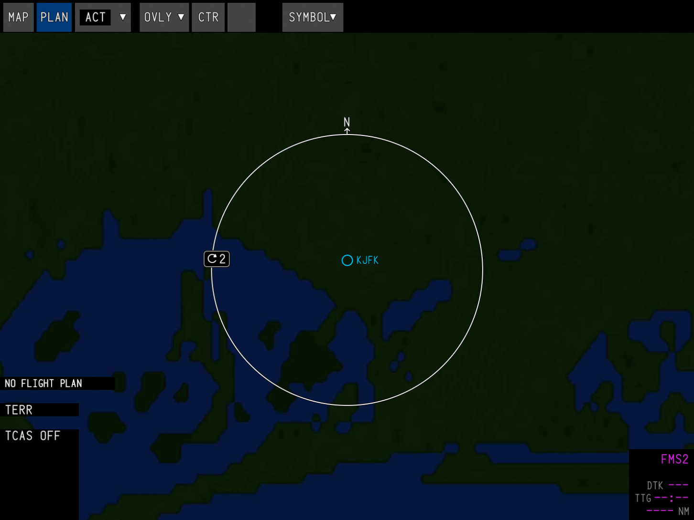
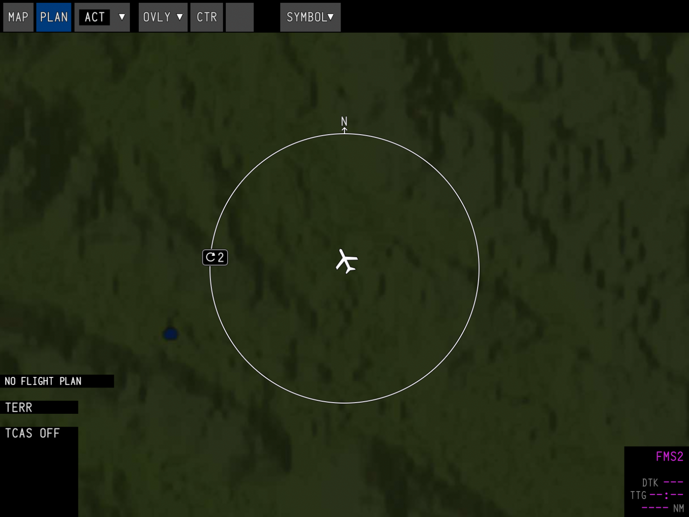
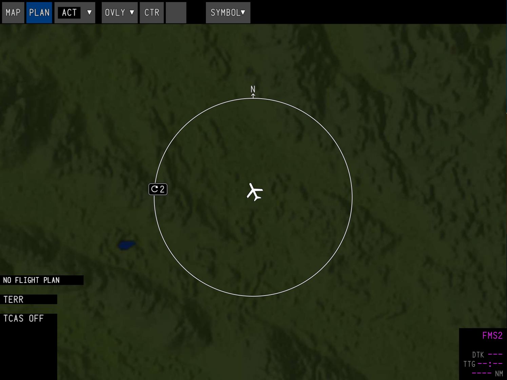

The map server provides map tile data to the aircraft's navigation display. Due to simulator limitations, this runs as an external process and serves the images to the avionics via a WebSocket. The server will use your integrated graphics device, if one is available, and then fallback to your primary graphics device.

## Installation

**With the simulator closed**, unzip `map-server-400.zip` or `map-server-1200.zip` into a directory of your choosing, and then simply run the `map-server.exe` file. This will open and immediately close a terminal window; this is the expected behavior.

The executable will modify your simulator's `exe.xml` file to launch the map server automatically when the simulator starts. The executable will automatically close when the simulator shuts down, but can also be manually closed.

    <LinkButton href="https://files.synapticsim.com/map-server-400.zip">
        Download map server, 400 res (1.6 GB)
    </LinkButton>
    <LinkButton href="https://files.synapticsim.com/map-server-1200.zip">
        Download map server, 1200 res (11.9 GB)
    </LinkButton>

<small>[Alternate download mirror](https://docs.synapticsim.com/pilots/map-server#resolutions)</small>

## Resolutions

At higher zoom levels, the map will look identical as it uses a lower LOD to reduce memory usage. The resolution only makes a noticeable difference when your range is set below 5 nautical miles.

<table>
    <thead>
        <tr>
            <th>400 res</th>
            <th>1200 res</th>
        </tr>
    </thead>
    <tbody>
        <tr>
            <td style={{ padding: 0 }}></td>
            <td style={{ padding: 0 }}></td>
        </tr>
        <tr>
            <td style={{ padding: 0 }}></td>
            <td style={{ padding: 0 }}></td>
        </tr>
    </tbody>
</table>
